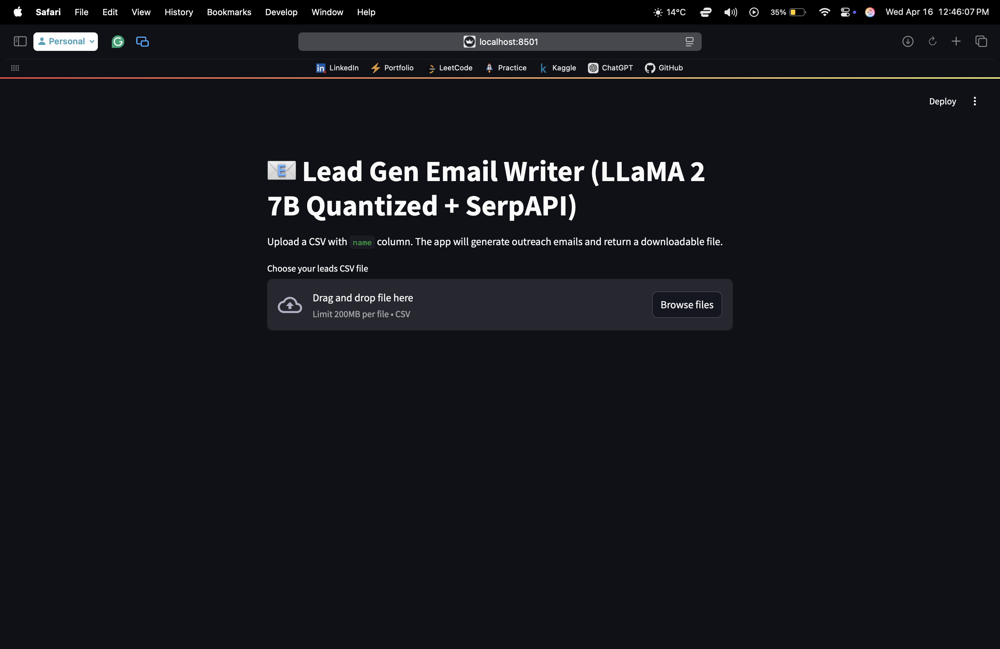

# 🧠 Multi-Agent Lead Generation with LLaMA 2

This Streamlit app uses a multi-agent architecture to generate personalized sales outreach emails using LLaMA 2 and SerpAPI. You upload a CSV of names, and the app:
- Searches for (eg:- vacation) interests using SerpAPI
- Generates a friendly, tailored email using LLaMA 2
- Reviews and refines each email with a built-in AI critic agent
- Exports a completed CSV with the generated emails

---

## ✨ Features

- 🔎 **Automated web search** using SerpAPI
- ✍️ **LLaMA 2-powered email generation** (7B quantized model)
- 👀 **Critic agent** gives feedback and improves drafts
- 📥 **Upload CSVs**, get tailored outreach at scale
- 🔒 **Runs entirely locally** with llama-cpp — no cloud required

---

## 📦 Setup

### 1. Clone this repo
```bash
git clone https://github.com/your-username/leadgen-multi-agent.git
cd leadgen-multi-agent
```

### 2. Install dependencies
```bash
pip install -r requirements.txt
```

### 3. Download a quantized LLaMA 2 model (e.g., .gguf from TheBloke)
Rename it to match:
```bash
mv llama-2-7b-chat.Q4_K_M.gguf llama-2-7b-chat.ggmlv3.q4_K_M.bin
```

### 4. Set environment variables
```bash
export LLAMA_MODEL_PATH=./llama-2-7b-chat.ggmlv3.q4_K_M.bin
export SERPAPI_API_KEY=your_key_here
```

### 5. Run the app
```bash
streamlit run leadgen_tool.py
```
---

## 🧾 Input Format
The uploaded CSV must include:
- name (Person's full name)

## 📤 Output
Returns a downloadable CSV with a new column: email_text.

## 📸 Screenshots


## 🔐 License

This project is **not open-source**. The code in this repository is provided for viewing and discussion purposes only.

All rights are reserved by the author. Commercial or personal use, redistribution, or modification is strictly prohibited without written permission.

For inquiries, contact: siddharth.goradia@icloud.com